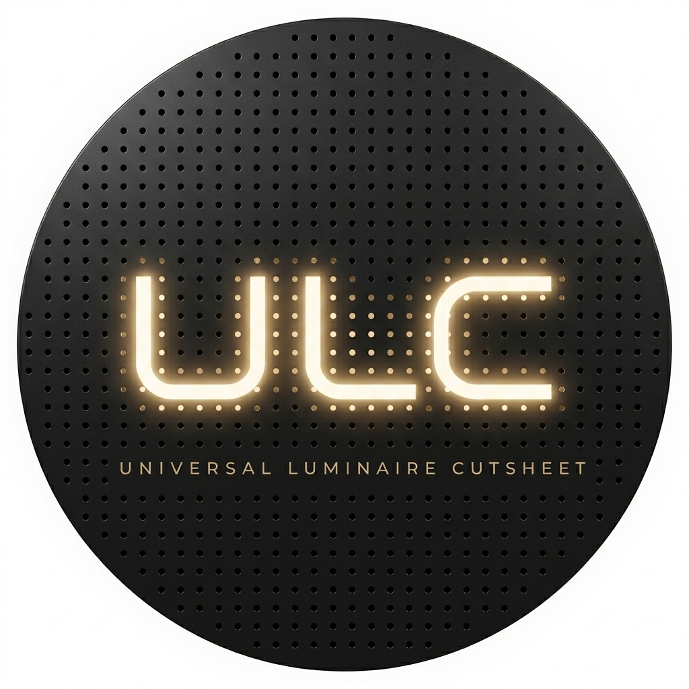

  

# ULC

**Universal Luminaire Cutsheet**

> "Cutsheet" in the name is the North American term for what is globally called a **datasheet**, the manufacturer's published technical summary of a luminaire. This document uses "datasheet" as the primary term in body text; both refer to the same document type.

ULC is an open specification for structured, machine-readable luminaire product data. A ULC file is a single JSON document that normalizes the information currently spread across manufacturer datasheets, IES photometric files, and EULUMDAT (LDT) files into one consistent, canonical record.

**A single ULC record represents one attested photometric scenario for a luminaire.** A product family with multiple distributions, output tiers, or color-rendition variants produces multiple ULC records, one per scenario, each carrying its own measurements and an applicability block that declares which orderable SKU configurations the record covers.

ULC does not replace those source files. It provides a normalized representation of their combined content that AI systems, design tools, specification software, and data pipelines can consume directly, with verifiable references back to the originals.

## Why ULC exists

Luminaire product data today is fragmented across thousands of PDF datasheets, each formatted differently, alongside decades-old text-based photometric files with inconsistent conventions. That worked while designers read datasheets one by one. It does not work now that AI systems are increasingly expected to consume product data at scale.

Structured JSON is orders of magnitude cheaper, faster, and more reliable for AI systems to process than running extraction pipelines over unstructured PDFs. For a specifier evaluating a hundred-product value engineering package against a hundred-product basis of design, the gap between structured and unstructured source data is the gap between an instant automated comparison and hours of manual reconciliation.

ULC closes that gap. The datasheet, IES, and LDT remain where they are, published as they always have been. The ULC file provides a normalized, machine-readable representation of their combined content, ready for any AI agent or software system to consume without preprocessing.

A universal schema also surfaces data quality issues that are invisible today. When every manufacturer uses their own taxonomy and their own notion of what belongs on a datasheet, cross-manufacturer comparison is unreliable by default. ULC defines a common structure where missing fields are explicit rather than hidden, which benefits every consumer of the data.

## What ULC is

A ULC record is a single JSON document that conforms to the ULC schema. It carries:

- Product identity, family, and taxonomy
- Physical dimensions in both SI and Imperial units
- Electrical, optical, photometric, and performance data
- Environmental ratings, compliance markings, and accessories
- Provenance for every extracted value, so the source of each field is always traceable
- References to the original source files (datasheet PDF, IES, LDT) including filename, optional URL, and a SHA-256 content hash for integrity verification

ULC does not embed source files. It identifies them. A consumer who obtains a source file through any channel can verify it matches the ULC record by comparing hashes.

## Source inputs

ULC is designed around the three source types that are realistically available today across the industry:

- PDF datasheets
- IES photometric files (ANSI/IES LM-63)
- EULUMDAT photometric files (LDT)

Additional source types and fields may be supported in future versions.

## Who uses ULC

| Audience | How they use ULC |
|---|---|
| Specifiers and designers | Consume ULC data indirectly through tools that read it. Benefit from fast, accurate, AI-assisted comparisons, luminaire schedules, and value engineering review. |
| Manufacturers | Publish ULC files alongside datasheet PDFs, IES, and LDT files on their product pages. Gain machine-discoverability by AI systems and improved data fidelity in downstream workflows. |
| Software vendors | Implement readers, writers, and validators against the ULC schema. A forthcoming reference CLI validator (see `tools/README.md`) will package conformance grading and source-file hash verification in one command; any JSON Schema Draft 2020-12 library can validate ULC records against the schemas today. |
| AI agents and assistants | Parse ULC files directly to answer product queries, compare alternates, generate documentation, and automate design tasks. Any JSON-aware system can consume the format, including general-purpose assistants such as ChatGPT and Claude and domain-specific agents such as LightingAgent.AI. |

Product discoverability is shifting. General-purpose search engines that once indexed PDF datasheets are being supplemented, and in some workflows replaced, by AI agents that retrieve and compare product data on the user's behalf. Machine-readable product data that can be parsed directly, without PDF extraction, is the input AI agents prefer. Manufacturers who publish ULC records put their products in reach of that new retrieval path.

This repository defines the standard. It does not ship an application.

## Repository structure

| Path | Contents |
|---|---|
| `schema/` | Two JSON Schema files (Draft 2020-12): `ulc.schema.json` defines the record structure; `taxonomy.schema.json` defines the closed-enum vocabulary. They are split so the taxonomy can be loaded independently by search and classification tools. Cross-file references are validated in CI. |
| `docs/` | Narrative specification, field reference, authoring guide, and `authoring-patterns.md` describing the four manufacturer authoring patterns the schema supports. |
| `examples/` | Canonical reference ULC records, one per manufacturer authoring pattern (A/B/C/D), drafted from real spec sheets and IES files. Source files are referenced by required SHA-256 hash and optional URL, not committed. |
| `templates/` | Starter templates for authors |
| `mappings/` | Crosswalks to GLDF and ETIM, plus guidance for parsing IES and LDT sources |
| `tools/` | Reference utilities including the schema drift guard (`schema-drift-guard.py`), the index builder (`build-index.py`), and a forthcoming CLI validator |
| `.github/` | Issue templates, pull request template, and continuous integration (including the schema drift guard workflow) |

## Getting started

The current working state ships the schema, taxonomy, drift-guard tooling, the authoring-patterns document, and four canonical reference records covering the four manufacturer authoring patterns. Deep narrative guides and the reference CLI validator are part of later batches.

- To understand the data model, read `docs/authoring-patterns.md`. It describes the four manufacturer authoring patterns ULC supports and the architectural primitives (product family, configuration, applicability, generated index, provenance classes, conditional attestations).
- To see those patterns in real data, read the four records in `examples/`. Each one exercises a distinct pattern against a real manufacturer spec sheet.
- To explore the schema directly, read `schema/ulc.schema.json` for the record structure and `schema/taxonomy.schema.json` for the closed vocabularies.
- To implement ULC in your own software, reference those two schema files by URL and use any JSON Schema Draft 2020-12 validator. The `tools/schema-drift-guard.py` script shows how `$ref`s resolve across the split.
- To regenerate a ULC record's `index` block, run `python3 tools/build-index.py <record>.ulc`. The index is always generated, never hand-authored.
- A forthcoming CLI validator in `tools/validator/` (later batch) will wrap conformance grading, source-file hash verification, and builder consistency checks in one command. Its status is tracked in `tools/README.md`.

## Relationship to adjacent standards

ULC is designed to cooperate with, not replace, existing work in the lighting data ecosystem:

- **GLDF** (Global Lighting Data Format) is the primary interchange container for the DIALux and RELUX planning ecosystems. ULC and GLDF address different problems: GLDF is a rich XML-based container optimized for photometric planning software, while ULC is a lightweight JSON specification optimized for structured datasheet data and AI consumption. This repository provides a field-level mapping between ULC and GLDF in `mappings/gldf-crosswalk.md`. Future tooling could generate GLDF output from ULC records, and vice versa, although neither direction is implemented as part of this repository at v0.1.
- **ETIM** (ElectroTechnical Information Model) provides a widely adopted classification vocabulary for product attributes in electrotechnical wholesale. Where ETIM codes apply to luminaire fields, ULC documents the corresponding ETIM feature identifiers in `mappings/etim-crosswalk.md`.
- **IES LM-63** and **EULUMDAT** remain the photometric data formats that feed ULC. ULC does not duplicate or replace their content. Guidance for extracting ULC field values from IES and LDT files is documented in `mappings/photometric-source-parsing.md`.

ULC does not redistribute the text of any paid or restricted standards. It references them by identifier.

## Project status

Version `0.1.0` establishes the foundation of the specification: the split schema (`ulc.schema.json` plus `taxonomy.schema.json`), the authoring-patterns document, and the drift-guard tooling. Version `0.2.0` adds four canonical reference records in `examples/`, one per manufacturer authoring pattern. The reference CLI validator, per-category authoring templates, and the ulcspec.org docs site land in subsequent batches. The specification will continue to evolve based on real-world use, industry feedback, and alignment with adjacent standards. See `CHANGELOG.md` for release notes.

## Contributing

Contributions are welcome from anyone working with luminaire product data: manufacturers, software vendors, specifiers, trade bodies, and researchers. Read `CONTRIBUTING.md` for how to propose changes, open issues, and submit pull requests. All participation is governed by `CODE_OF_CONDUCT.md`.

## Governance

ULC is stewarded by its originator with input from the industry bodies and collaborators engaged in its development, and is intended to grow into a broadly supported open standard. See `GOVERNANCE.md` for origin, stewardship, decision-making process, and guiding principles.

## License

ULC is published under the MIT License. See `LICENSE`.
